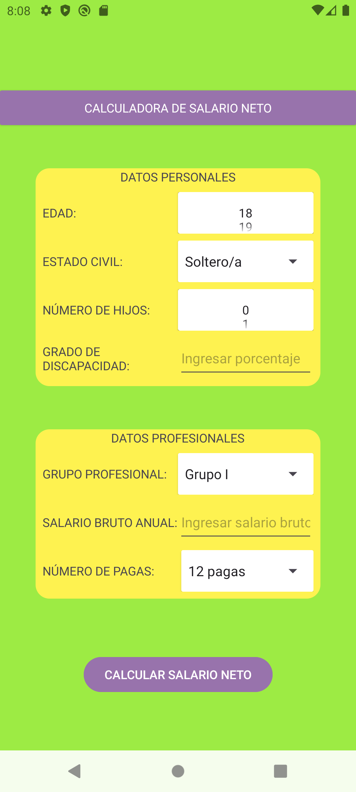
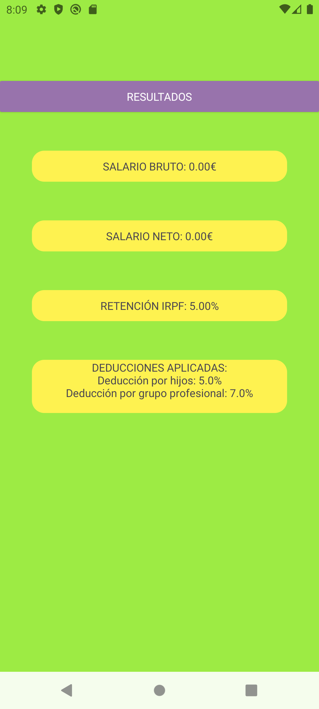

# Calculadora Salario Neto

📚 DAM – Programación Multimedia y Dispositivos Móviles (PMDM)  
✍️ Entrega - App Android en **Kotlin** con interfaz **XML** que calcula el salario neto en base a datos personales y profesionales.

## 🛠️ Tecnologías

## ⚙️ Funcionalidad
- Introducción de datos personales y profesionales (edad, estado civil, hijos, discapacidad, grupo, salario bruto, pagas).  
- Aplicación de reglas de **IRPF** y deducciones según el perfil.  
- Pantalla de resultados con salario neto, retenciones y desglose de deducciones.  
- Comunicación entre actividades con **Intents**.  

## 📸 Vista previa
Pantallas de entrada de datos y resultados en la app:

   
